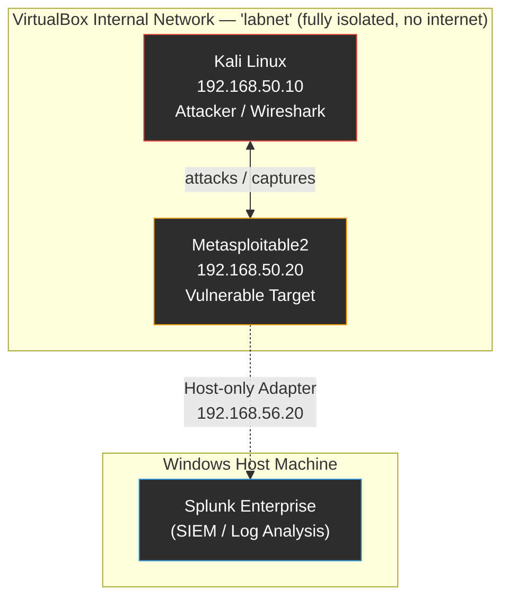
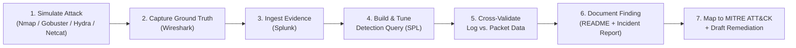
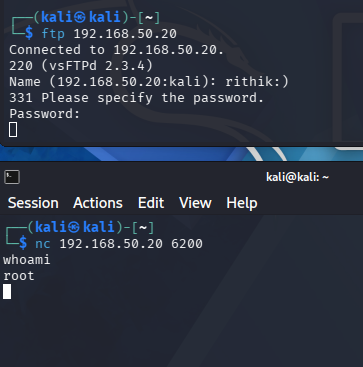
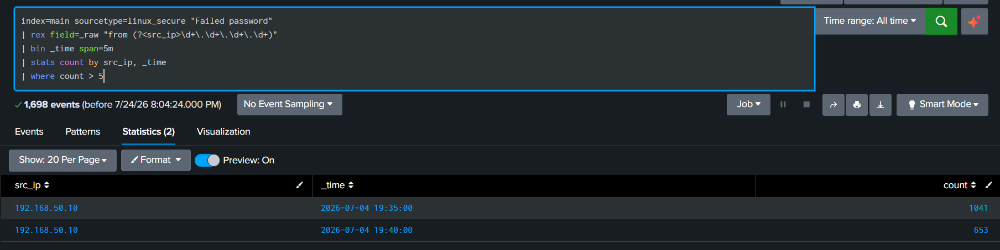
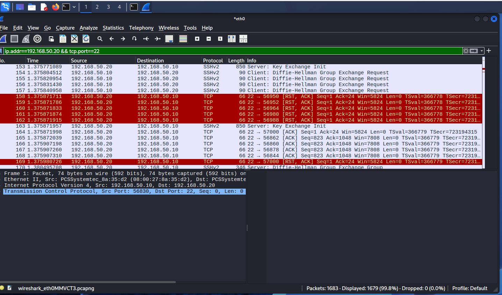
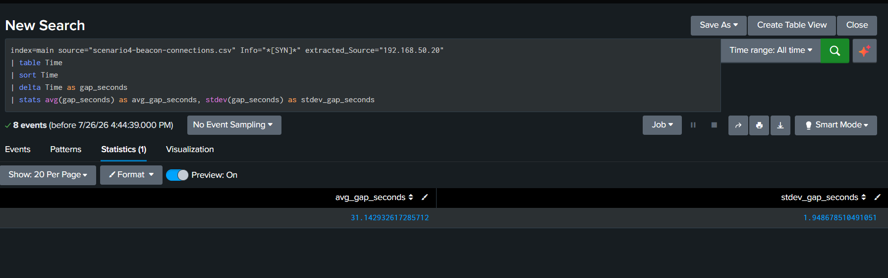
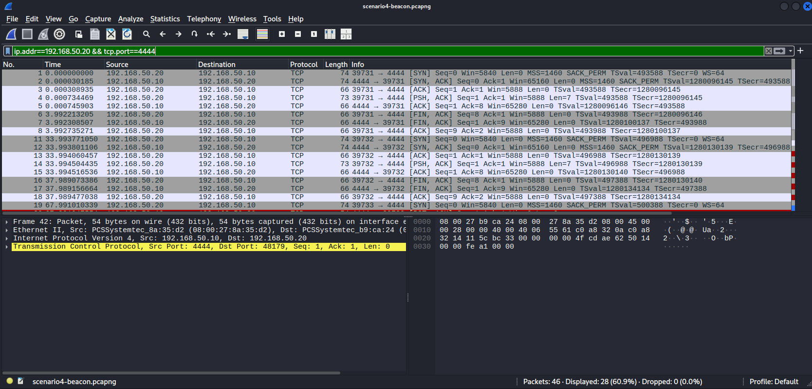

# 🛡️ Network Threat Simulation and Incident Validation Lab


A self-contained, fully isolated home lab used to generate controlled security events, investigate them using a SIEM (Splunk) and packet-level analysis (Wireshark), extract indicators of compromise, map every finding to MITRE ATT&CK, and document the full incident investigation workflow the way an analyst would hand it off to the next shift.

All activity in this repository was generated in a private, isolated virtual network against systems I own and control. No public systems, real organizations, or third-party infrastructure were involved at any point.

📘 **For the complete, detailed walkthrough of this project — every command, every failure encountered, every fix, and every screenshot — see the [Project Handbook](PROJECT-HANDBOOK.md).**

---

## 📑 Table of Contents

- [Why This Project Exists](#-why-this-project-exists)
- [Objectives](#-objectives)
- [Lab Architecture](#-lab-architecture)
- [Technologies Used](#-technologies-used)
- [Skills Demonstrated](#-skills-demonstrated)
- [Project Workflow](#-project-workflow)
- [Scenarios](#-scenarios)
- [Detection Engineering](#-detection-engineering)
- [Findings Summary](#-findings-summary)
- [Challenges Encountered and How They Were Solved](#-challenges-encountered-and-how-they-were-solved)
- [MITRE ATT&CK Mapping](#-mitre-attck-mapping)
- [Indicators of Compromise](#-indicators-of-compromise)
- [Folder Structure](#-folder-structure)
- [Lessons Learned](#-lessons-learned)
- [Future Improvements](#-future-improvements)
- [References](#-references)
- [License](#-license)
- [Author](#-author)

---

## 🎯 Why This Project Exists

Most SOC analyst portfolios show tools. This one shows workflow: generate an event, catch it in logs, prove it happened at the packet level, write the detection query, tune it, and document the finding the way an analyst would write it up for a shift handoff. Every number in this repository — every packet count, every failed login, every timing interval — was independently verified across at least two data sources (log data and raw packet capture) before being recorded as a finding.

## 🎯 Objectives

- Simulate four distinct, realistic attack techniques against an intentionally vulnerable target in a fully isolated lab
- Detect and validate each technique using both a SIEM (Splunk) and independent packet-level analysis (Wireshark)
- Build and tune real, working detection queries — not copy-pasted examples
- Map every confirmed finding to the MITRE ATT&CK framework
- Document each investigation to the standard of a real incident report, including negative findings and troubleshooting narratives
- Draft remediation recommendations grounded in the actual technical root cause of each finding

## 🏗️ Lab Architecture



| Component | Role | Details |
|---|---|---|
| Kali Linux | Attacker platform / Wireshark capture point | Kali Rolling 2026.1 · `192.168.50.10` (eth0, labnet) · IP resets on reboot, manually re-added each session |
| Metasploitable2 | Intentionally vulnerable target | Ubuntu 8.04 · `192.168.50.20` (eth0, labnet) / `192.168.56.20` (eth1, host-only, reaches Splunk) |
| Windows Host | Splunk deployment | Splunk Enterprise (60-day trial), accessed via browser, not part of the isolated labnet segment |
| Network mode | Isolation boundary | VirtualBox Internal Network ("labnet") — no bridged adapter, no NAT, no internet access |

Full details: [`architecture/lab-architecture.md`](architecture/lab-architecture.md)
Full asset inventory: [`asset-inventory.md`](asset-inventory.md)

## 🧰 Technologies Used

| Category | Tools |
|---|---|
| Virtualization | VirtualBox (Internal Network mode) |
| Attacker OS | Kali Linux Rolling 2026.1 |
| Target OS | Metasploitable2 (Ubuntu 8.04, intentionally vulnerable) |
| SIEM | Splunk Enterprise |
| Packet Analysis | Wireshark |
| Attack Simulation | Nmap, Gobuster, Hydra, Netcat |
| Detection Engineering | SPL (Splunk Search Processing Language), Sigma rules |
| Documentation | Markdown, Mermaid diagrams |

## 🧠 Skills Demonstrated

- **Reconnaissance & Enumeration** — full-port service/version scanning (Nmap), web path enumeration (Gobuster)
- **Exploitation Validation** — confirming a known CVE-backed backdoor (vsftpd 2.3.4 / CVE-2011-2523) results in genuine unauthenticated root access, not just a theoretical finding
- **Detection Engineering** — writing SPL from scratch against real ingested log data, including manual field extraction (`rex`) where automatic extraction failed
- **Volume-Based Detection** — threshold-based brute-force detection (failed logins per time window)
- **Timing-Pattern Detection** — a distinct, more advanced technique: identifying C2 beaconing by statistical consistency of connection intervals (average + standard deviation) rather than by count
- **Cross-Source Validation** — independently confirming every Splunk finding against raw Wireshark packet captures before logging it as a true positive
- **Incident Documentation** — writing a full incident investigation report (executive summary, timeline, root cause, impact assessment, remediation) to a professional standard
- **MITRE ATT&CK Mapping** — mapping every confirmed technique to the correct Technique ID with a justification, not just a label
- **Troubleshooting Under Real Conditions** — diagnosing and resolving IP conflicts, Splunk sourcetype misdetection, and tooling quirks (missing `timeout` binary, netcat `-k` flag not behaving as documented) without losing the underlying evidence

## 🔄 Project Workflow



## 📋 Scenarios

| # | Scenario | Status | Detection Method | MITRE Technique(s) |
|---|---|---|---|---|
| 1 | [Network Reconnaissance and Port Scanning](scenarios/01-network-reconnaissance/README.md) | ✅ Complete | Wireshark + Nmap output | T1595, T1046 |
| 2 | [Repeated SSH Authentication Failures](scenarios/02-ssh-brute-force/README.md) | ✅ Complete | Splunk (volume threshold) + Wireshark | T1110.001, T1021.004 |
| 3 | [Suspicious HTTP Path Enumeration](scenarios/03-http-path-enumeration/README.md) | ✅ Complete | Wireshark + Gobuster output | T1595.003, T1592 |
| 4 | [Controlled Periodic Outbound Beacon](scenarios/04-outbound-connection/README.md) | ✅ Complete | Splunk (timing-pattern analysis) + Wireshark | T1071, T1571 |

Each scenario's own README contains the full investigation writeup: objective, prerequisites, exact commands run, full evidence, Wireshark filters, working SPL queries (where applicable), investigation questions with answered analysis, IOC tables, timeline, true/false positive assessment, MITRE mapping, and remediation recommendations.

## 🔍 Detection Engineering

- [**SPL Query Documentation**](detection-engineering/spl-queries.md) — every working Splunk query used across all four scenarios, with line-by-line explanation and real results
- [**Detection Tuning Report**](detection-engineering/detection-tuning-report.md) — threshold rationale and tuning decisions for each detection rule
- [**Sigma Rules**](detection-engineering/sigma-rules/) — vendor-agnostic Sigma translations of the two SPL-based detections, for portability to any SIEM:
  - [`ssh-brute-force.yml`](detection-engineering/sigma-rules/ssh-brute-force.yml) — volume-based SSH brute-force detection
  - [`periodic-beacon.yml`](detection-engineering/sigma-rules/periodic-beacon.yml) — timing-based C2 beacon detection

## 📊 Findings Summary

| Scenario | Key Finding | Evidence |
|---|---|---|
| 1 — Recon | 23 of 1,000 scanned ports open in 15.32 seconds; vsftpd 2.3.4 backdoor (CVE-2011-2523) confirmed exploitable, yielding unauthenticated root access | [`evidence/scenario-01/`](evidence/scenario-01/) |
| 2 — SSH Brute Force | 1,694 failed logins from a single IP detected via a custom SPL threshold query (>5 failures / 5 min), cross-validated against 1,679 matching Wireshark packets | [`evidence/scenario-02/`](evidence/scenario-02/) |
| 3 — HTTP Enumeration | `phpinfo.php` confirmed as a real information-disclosure finding (leaked PHP/Apache/MySQL versions and file paths); phpMyAdmin and TWiki injection both tested and confirmed **negative** | [`evidence/scenario-03/`](evidence/scenario-03/) |
| 4 — Periodic Beacon | Outbound beacon detected with a 31.14-second average interval and only a 1.95-second standard deviation across 8 attempts — a statistically strong periodicity signature, independently recalculated outside Splunk to confirm accuracy | [`evidence/scenario-04/`](evidence/scenario-04/) |

### 🖼️ Evidence Highlights

**Scenario 1 — vsftpd Backdoor Exploitation Confirmed**

Direct confirmation of unauthenticated root access via the vsftpd 2.3.4 backdoor: `whoami` returns `root`, `id` returns `uid=0(root)`.

**Scenario 2 — SSH Brute Force Detection Query**

The working SPL detection query identifying two attack windows (1,041 and 653 failed logins) from a single source IP, totaling 1,694 — an exact match to the original attack log.

**Scenario 2 — Wireshark Cross-Validation**

1,679 packets independently confirmed matching the SSH attack traffic filter, validating the Splunk finding at the network level.

**Scenario 4 — Periodic Beacon Timing Analysis**

The timing-based detection query result: a 31.14-second average interval with only 1.95 seconds of standard deviation — proof of automated, machine-generated periodicity rather than human-driven traffic.

**Scenario 4 — Wireshark Beacon Capture**

Full packet-level capture of the first two successful beacon check-ins, showing the complete TCP handshake and payload delivery exactly 33.99 seconds apart.

Full evidence sets for every scenario, including additional supporting screenshots, are available in [`/evidence/`](evidence/).

## 🧩 Challenges Encountered and How They Were Solved

| Challenge | Resolution |
|---|---|
| Kali and Metasploitable2 IPs reset on every VM reboot | Documented the exact `ip addr add` / `ip link set` commands required after every reboot; built this into the standard startup procedure for every scenario |
| Kali's IP was accidentally set to the same address as the target (`.20`) after a reboot, causing `ping` to falsely succeed while HTTP/SSH failed | Diagnosed via `ip addr show \| grep 192.168.50`, resolved with `ip addr del` followed by re-adding the correct address; documented as a real, recurring lab issue rather than hidden |
| Splunk auto-detected the wrong sourcetype for the SSH auth log | Manually overrode the sourcetype to `linux_secure` during upload, and verified event parsing in the preview pane before proceeding |
| Splunk did not auto-extract the source IP field from the raw auth log | Built a manual `rex` field extraction into the SPL query rather than relying on automatic field discovery |
| Splunk alert repeatedly failed to save with "enable at least one action" | Root-caused to a missing trigger action; resolved by explicitly adding a trigger action (Add to Triggered Alerts) before saving |
| Netcat's `-k` flag did not keep the listener alive across multiple connections as documented | Worked around by restarting the listener as needed; confirmed via Wireshark that the underlying beacon traffic pattern was unaffected by the listener's behavior |
| Metasploitable2 (Ubuntu 8.04) does not have the `timeout` binary installed | Used netcat's own built-in `-w` connection-timeout flag instead, achieving the same effect without requiring an additional package |
| Beacon loop's connections were refused after the first two successful check-ins | Diagnosed as a listener-availability issue, not a beacon-timing issue — confirmed the beacon continued attempting to connect on the exact same ~30-second schedule regardless of refusal, which was itself documented as realistic malware behavior (a compromised host continuing to check in even when its C2 server is temporarily unreachable) |

## 🗺️ MITRE ATT&CK Mapping

| Technique ID | Name | Scenario | Justification |
|---|---|---|---|
| T1595 | Active Scanning | 1 | Nmap actively probed 1,000 ports against the target to identify live services |
| T1046 | Network Service Discovery | 1 | Service/version detection (`-sV`) fingerprinted exact software versions on every open port |
| T1110.001 | Brute Force: Password Guessing | 2 | Hydra systematically tried a leaked password list against a single known username via SSH |
| T1021.004 | Remote Services: SSH | 2 | The targeted service was SSH remote login |
| T1595.003 | Active Scanning: Wordlist Scanning | 3 | Gobuster systematically requested 4,613 paths from a wordlist against the target web server |
| T1592 | Gather Victim Host Information | 3 | `phpinfo.php` disclosure provided detailed software version and file path information with no exploitation required |
| T1071 | Application Layer Protocol | 4 | The simulated beacon used a TCP connection to communicate with the listener, simulating an application-layer C2 channel |
| T1571 | Non-Standard Port | 4 | Port 4444 is a well-known non-standard port commonly associated with C2 tooling in real-world attacks |

## 🎯 Indicators of Compromise

| Type | Value | Scenario |
|---|---|---|
| Attacker IP | `192.168.50.10` | 1, 2, 3, 4 |
| Target IP | `192.168.50.20` | 1, 2, 3, 4 |
| Backdoored service (confirmed exploitable) | vsftpd 2.3.4, port 21 (CVE-2011-2523) | 1 |
| Pre-existing root bindshell | Port 1524 | 1 |
| Brute-forced account | `msfadmin` (SSH) | 2 |
| Failed login volume | 1,694 attempts, password source: `rockyou.txt` | 2 |
| Disclosed information | PHP 5.2.4-2ubuntu5.10, Apache 2.2.8, MySQL client 5.0.51a, document root `/var/www/` | 3 |
| C2 listener port | 4444/tcp | 4 |
| Beacon interval | 31.14s average, 1.95s standard deviation | 4 |

## 📁 Folder Structure

```
network-threat-simulation-lab/
├── README.md
├── PROJECT-HANDBOOK.md
├── LICENSE
├── asset-inventory.md
├── lessons-learned.md
├── architecture/
│   └── lab-architecture.md
├── detection-engineering/
│   ├── spl-queries.md
│   ├── detection-tuning-report.md
│   └── sigma-rules/
│       ├── ssh-brute-force.yml
│       └── periodic-beacon.yml
├── incident-reports/
│   └── incident-report-01.md
├── scenarios/
│   ├── 01-network-reconnaissance/
│   │   └── README.md
│   ├── 02-ssh-brute-force/
│   │   ├── README.md
│   │   └── logs/
│   ├── 03-http-path-enumeration/
│   │   └── README.md
│   └── 04-outbound-connection/
│       ├── README.md
│       └── logs/
│           └── scenario4-beacon-connections.csv
├── evidence/
│   ├── scenario-01/
│   ├── scenario-02/
│   ├── scenario-03/
│   ├── scenario-04/
│   ├── troubleshooting/
│   └── github-setup/
```

## 🧭 Lessons Learned

Full reflection on what worked, what didn't, and what would change in a second pass: [`lessons-learned.md`](lessons-learned.md)

## 🚀 Future Improvements

- Extend Splunk correlation to Scenario 1 (port scan) and Scenario 3 (HTTP enumeration), which currently rely on Wireshark and tool output alone
- Add a pfSense instance in front of the target to generate firewall-level logs as an additional detection layer
- Expand the Scenario 4 beacon simulation to use a commonly allowed port (443 or 53) to more realistically simulate C2 traffic blending in with legitimate traffic
- Automate the standard IP-reset procedure with a startup script to remove the manual step after every VM reboot
- Build a Splunk dashboard consolidating all four scenarios' detections into a single view

## 📚 References

- [MITRE ATT&CK Framework](https://attack.mitre.org/)
- [CVE-2011-2523 — vsftpd 2.3.4 Backdoor](https://nvd.nist.gov/vuln/detail/CVE-2011-2523)
- [CVE-2004-2649 — TWiki Command Injection](https://nvd.nist.gov/vuln/detail/CVE-2004-2649)
- [Splunk Search Processing Language (SPL) Reference](https://docs.splunk.com/Documentation/Splunk/latest/SearchReference/WhatsInThisManual)
- [Sigma Rule Specification](https://github.com/SigmaHQ/sigma)
- [Metasploitable2 Documentation](https://docs.rapid7.com/metasploit/metasploitable-2/)

## 📄 License

This project is licensed under the [MIT License](LICENSE).

## 👤 Author

**Rithika Gowdelli**
M.S. Cybersecurity, University of Houston
CompTIA Security+ · EC-Council EHE, NDE, Cybersecurity Attack and Defense Fundamentals · WiCyS Member

[GitHub](https://github.com/RithikaGowdelli)
